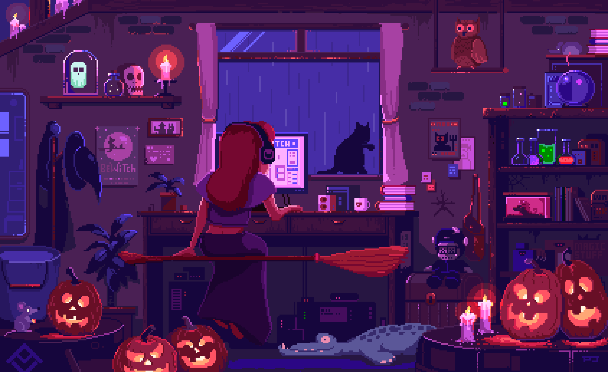
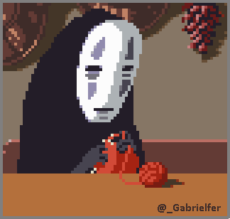

# 👋 Hello world, I'm Heidi Albarazi
I'm a passionate **developer**, **designer**, and **artist** with a love for blending creativity with technology. Currently, I'm studying **Computer Science** at the **Technical University of Munich (TUM)** while interning as a **Software Engineer at JetBrains**. I love diving into new challenges, especially at **hackathons**, where I get to push the limits of creativity and code. 🎉

---

## 🎨 What I Love:

- **Hackathons**: Nothing excites me more than the adrenaline of a hackathon, where I get to create, innovate, and solve problems alongside like-minded tech enthusiasts. 💻
- **Fashion & Tech Fusion**: I'm fascinated by the intersection of fashion and technology, and I love exploring ways to merge these fields creatively.
- **Halloween Enthusiast** 🎃: I have a special love for all things Halloween! From costumes to decorations, I enjoy bringing spooky vibes into my art and projects.
- **Coding & Tech**: Whether it’s building efficient algorithms, creating stunning designs, or crafting user-friendly interfaces, coding is where I let my imagination flow! ⚡
- **Arts & Games**: I’m an avid gamer and artist, constantly inspired by the art and creativity in games. 🎮
- **Arts & Crafts** 🧶: I love crocheting, drawing, and crafting—turning simple materials into unique, handmade pieces.

---

## 🧑‍💻 Currently

- 🎓 **Computer Science Student** at **[Technical University of Munich](https://www.tum.de)** (TUM), working toward my **Bachelor's** degree.
- 💼 **Software Engineering Intern** at **[JetBrains](https://www.jetbrains.com)**, learning from some of the best in the field and expanding my skills in software development.

---

## 💻 Tech Stack:
                                                                        

---

## 📊 GitHub Stats:
 
 

---

### 🏆 GitHub Trophies

---

